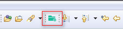
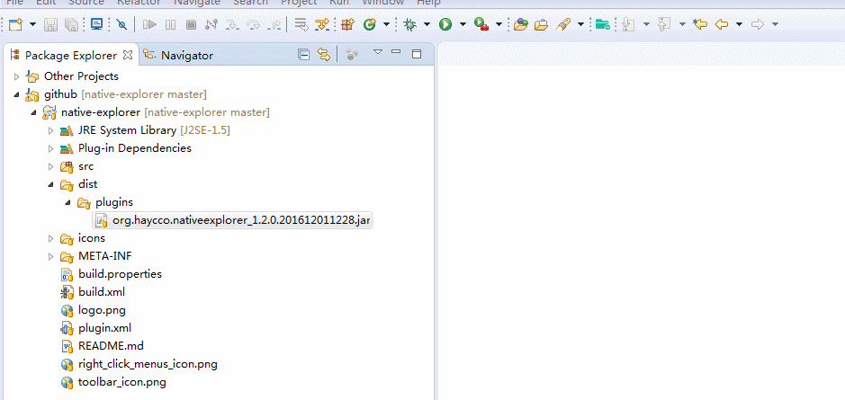
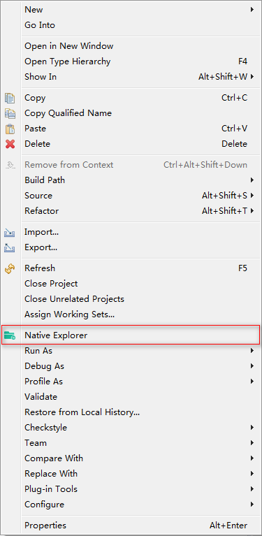
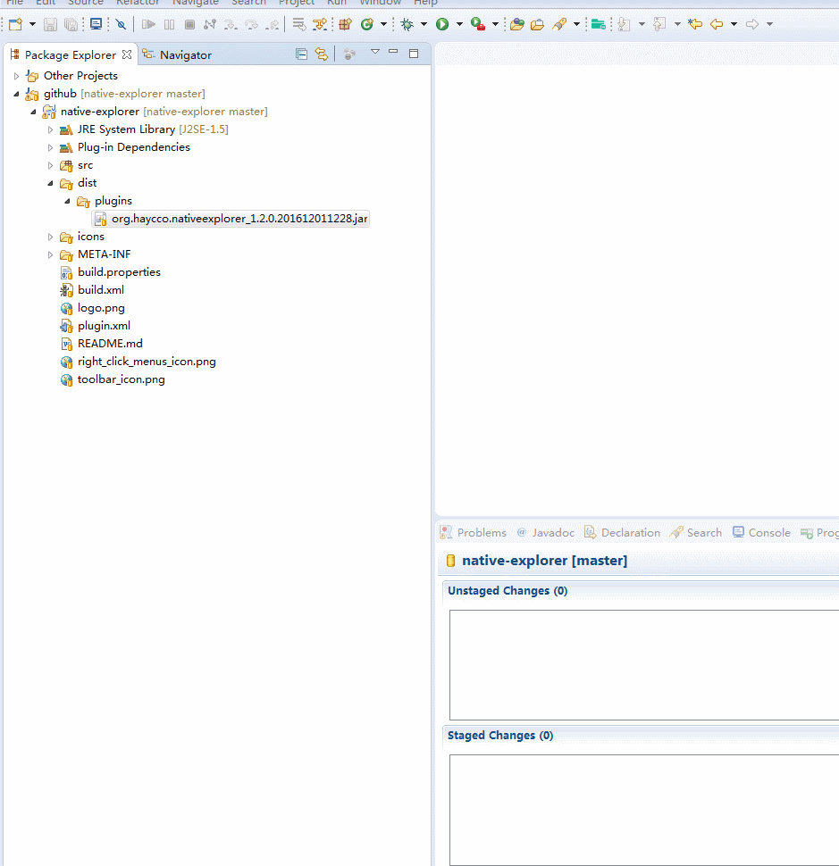

Native Explorer  
==========

eclipse plugin project

NativeExplorer is an Eclipse plugin to embed Windows Explorer and keep it in sync with your work. 

Current v1.2.0 [Download](./dist/plugins/org.haycco.nativeexplorer_1.2.0.201604192322.jar)

	

Features
============================
sync with package explorer 
sync with project explorer 
pop out native explorer window 
browsing history 
open Explorer View for selected folder/package Explorer view 

Usage
============================
copy native explorer plugin (dist/plugins/org.haycco.nativeexplorer_*.jar) to you eclipse directory by
* [${USER_LOCATION}\eclipse\dropins] folder understore

Toolbar icon

Right Click Menus icon

Requirements
============================
* JDK 5 above
* Eclpise 3 above